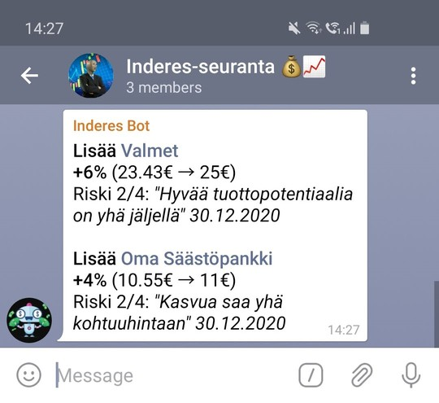

# Inderes tracker

Tracks stock analysis from [Inderes.fi](https://www.inderes.fi). Sends daily notifications of changes in stock recommendations to Telegram.

## Getting started

    npm install
    npm run build
    npm run start

By default, when run locally, the program will do a dryrun, printing the HTML-formatted content of the messages instead of sending the messages to Telegram.

In order to send messages to Telegram, you'll need to setup a bot and a chat, and either disable the local dryrun, or deploy the program to AWS Lambda.

### Testing

    npm run build
    npm run lint
    npm run test

When running `npm install`, husky should setup a pre-commit hook, so these will be run automatically before each commit.

### Deploying

    npm install serverless
    sls deploy

## Disclaimer

This source code is provided as is. This code nor its authors do not provide financial advice, and you are to do your own research.

## Acknowledgements

This program uses:

- [**inderes.fi**](https://www.inderes.fi/fi) to fetch stock analysis and prices
- [**telegram.org**](https://telegram.org/) to send push notifications
